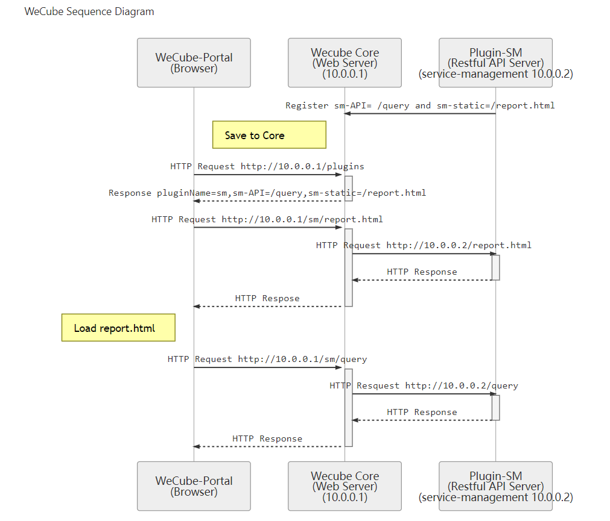

# 插件注册方案

## 名词解释及缩写
  Core： 本文特指WeCube-Core。  
  Portal： 本文特指WeCube-Portal。  

## 背景
WeCube-Core作为一个IT管理系统，需要支持各种各样的插件，现有需求是开发一个自带UI的wecube-plugin-service-management插件，所以当WeCube-Core和插件运行时，WeCube-Portal需要拉取插件的静态页面资源向用户展示，提供插件的功能。  

## 分析
用户在浏览器登陆WeCube后，浏览器拉取Portal的html\css\js等静态资源文件在浏览器上运行，用户需要访问插件时，应由Core提供插件的静态资源；  
Core需要分辨出哪些静态资源是Portal的，哪些是插件A的，哪些是插件B的...；  
所以在插件注册时，注册信息需要包括静态资源的地址；  

综上分析，Core需要做以下改造：  
1.插件注册时，Core支持记录插件的所有静态资源地址，并以插件名标识。  
2.Portal在用户登陆后需要向Core请求已注册插件的菜单。  
3.Core可以转发Portal对插件静态资源的请求，并返回。  
4.Core可以转发Portal对插件API的请求，并返回。  

## 时序图

  

## 备用方案
### 方案描述
插件启动时，Core将插件包中的static目录（即静态资源所在目录）放到Core的static目录下。  

### 方案劣势
Core的发布包是一个jar包，如果要把插件的static目录动态部署到Core的static里面，那么需要将Core的static目录外挂，可行性有待研究，并且影响范围较大。
