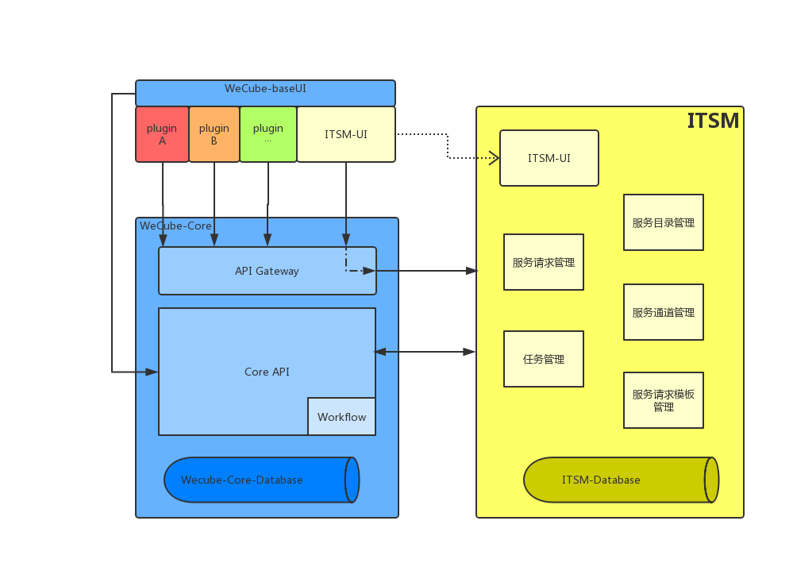
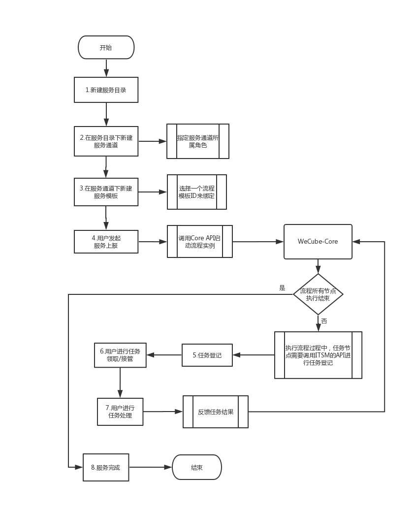

# WeCube Plugin 服务管理插件设计

## 名词解释
 服务目录：某部门或某个分组提供的一系列服务。

 服务通道：服务目录下的服务详细分类。

 服务请求：服务请求可以是一个故障/告警/咨询/服务申请的请求。

## 背景
WeCube的产品定位于IT系统的管理工具，需要提供一个通用的可通过工作流流转的服务管理插件。

## 分析与设计

### 前端视角
功能分为两部分：模板管理和服务管理。

1. 模板管理。

	模板管理分为两部分：服务目录管理和服务请求模板定义。

	- 服务目录管理：
	
		提供服务目录新增和删除功能，每个服务目录下可以新增和删除服务通道。

	- 服务请求模板定义：

		提供服务请求模板定义功能，设置模板属性，选择所属角色。

2. 服务管理。
	服务管理包括服务请求管理和任务管理。

	- 服务请求管理:
		
		包含服务请求上报和服务请求查询。

	- 任务管理：
		
		包含本组发起（服务请求）和本组处理（任务）。

		本组发起（服务请求）：本组发起可查看本组人员发起的所有服务请求，并提供服务请求上报功能。

		本组处理（任务）：本组处理可查看需要本组人员处理的所有任务，可以领取任务，接管别人未完成的任务，已完成的任务可以填入处理结果。

### 后端视角
经了解，用户提出本需求主要是为了解决WeCube上的服务请求管理功能；

基于MVP产品原则，本期开发目标是实现最小闭环功能，需要实现的产品功能包括以下：

1. 建立持久化数据库，包括服务目录表、服务通道表、服务请求模板表、服务请求表、任务表。
2. 服务目录管理，包括新增、删除、查询。
3. 服务通道管理，包括新增、删除、查询。新增时需要指定所属角色。
4. 服务请求模板定义，主要定义服务请求所属服务通道，定义模板对应工作流ID。
5. 服务请求管理，包括上报和查询。
6. 任务管理，包括登记、领取、处理、接管。

ServiceManagement架构图如下：

  

用户使用流程图如下：
  

流程说明：

1. 管理用户在<模板管理>-<服务目录管理>菜单下进行服务目录新增；
2. 管理用户在<模板管理>-<服务目录管理>菜单下进行服务通道新增；新增时，指定所属角色；
3. 管理用户在<模板管理>-<事件模板定义>菜单下进行事件模板新建；新建模板需要指定所属服务通道和绑定流程ID；
4. 一般用户在<任务管理>-<事件上报>菜单下发起事件上报；事件上报会调用WeCube-Core的API去启动流程；
  WeCube-Core将会：
  `启动流程，流程执行过程中，遇到任务节点将会调用ITSM的API去登记任务，然后等待任务结果反馈再往下执行；直到流程执行完毕后，流程调用ITSM的API告知流程结束`
5. WeCube-Core会在流程执行过程中调用任务登记；任务登记后状态为待领取；
6. 用户在<任务管理>菜单下根据用户权限查询任务列表，可以领取状态为“待领取”的任务，或接管状态为“待处理”且在他人名下的任务；
7. 用户在<任务管理>菜单下根据用户权限查询已领取任务的列表，点击处理，选择处理成功或处理失败，然后提交；本插件会将该结果反馈回WeCube-Core。
8. 本插件收到事件完成的结果，将事件状态更新为“已完成”。

## 技术选型
ServiceManagement定位是一个插件，是一个微服务，它应该是通过基于HTTP/HTTPS协议的RESTful API进行通信协作，维护着自身的数据存储，业务开发，自动化测试案例以及独立部署机制，对外提供服务管理的功能，为了减少开发成本且契合微服务的定位，后端技术选型为Java + Spring boot。
  
Spring Boot是由Pivotal团队提供的全新框架,其设计目的是用来简化新 Spring应用的初始搭建以及开发过程。该框架使用了特定的方式来进行配置,从而使开发人员不再需要定义样板化的配置。

为减少现阶段Wecube前端基座路由开发成本，ITSM插件前端技术选型为Vue + Vue-Router。
