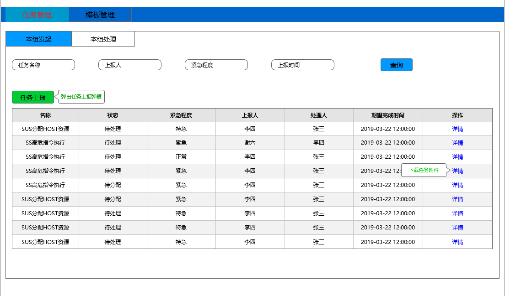
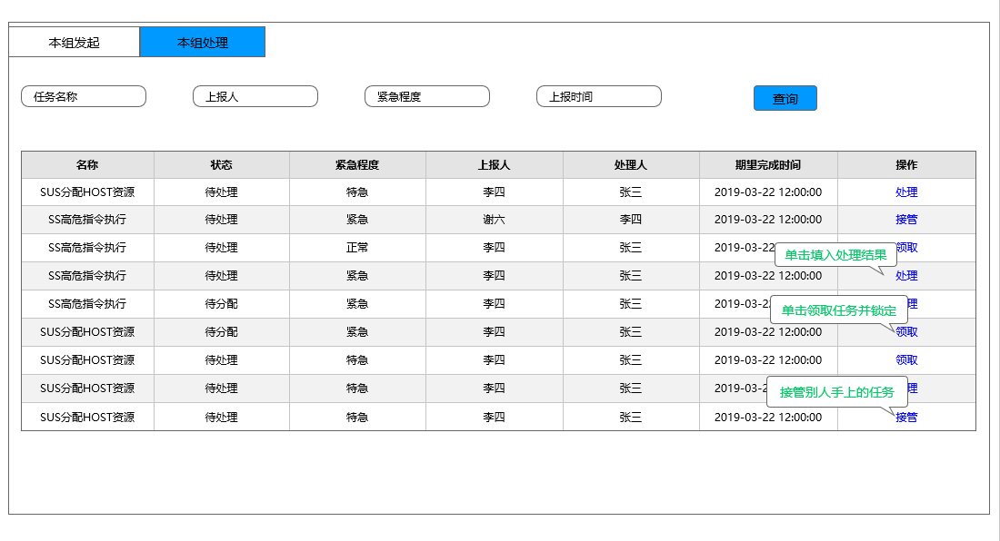
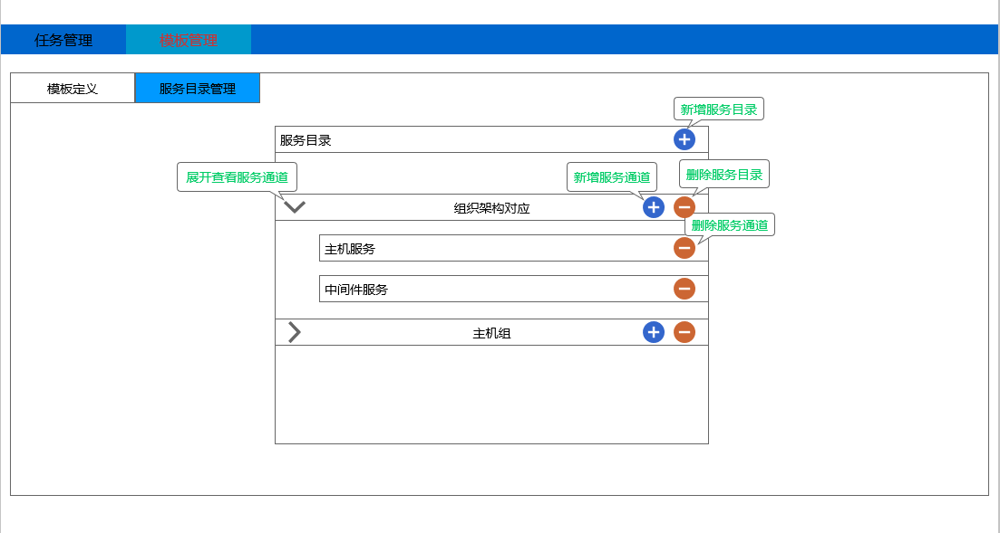
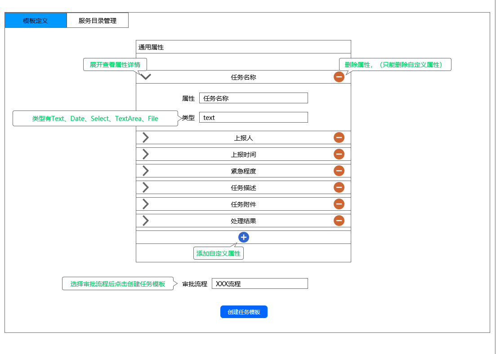

# WeCube Plugin 服务管理插件前端设计

## 名词解释
IT服务管理（ITSM）是一套帮助企业对IT系统的规划、研发、实施和运营进行有效管理的方法。

## 背景
WeCube的产品定位于IT系统的管理工具，需要提供标准的服务管理的插件。

## 分析
为实现服务管理最小闭环，功能分为两部分：任务管理和模板管理。

1. 任务管理。

	任务管理分为两部分：本组发起和本组处理。
	
	1.1 本组发起：本组发起可查看本组人员发起的所有任务，并提供任务上报功能。
	
	1.2 本组处理：本组处理可查看需要本组人员处理的所有任务，可以领取任务，接管别人未完成的任务，已完成的任务可以填入处理结果。

2. 模板管理。

	模板管理分为两部分：模板定义和服务目录管理。

	2.1 模板定义：提供任务模板定义功能，设置任务模板属性，选择任务审批流程。

	2.2 服务目录管理：提供服务目录新增和删除功能，每个服务目录下可以新增和删除服务通道。

## 技术选型

为减少现阶段Wecube前端基座路由开发成本，服务管理插件前端技术选型为Vue + Vue-Router

## 页面设计

任务管理页面

模板管理页面

